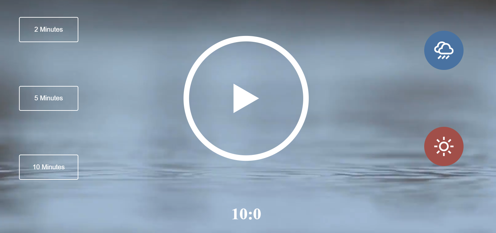
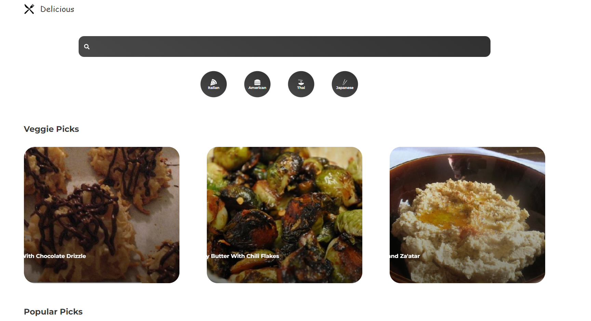
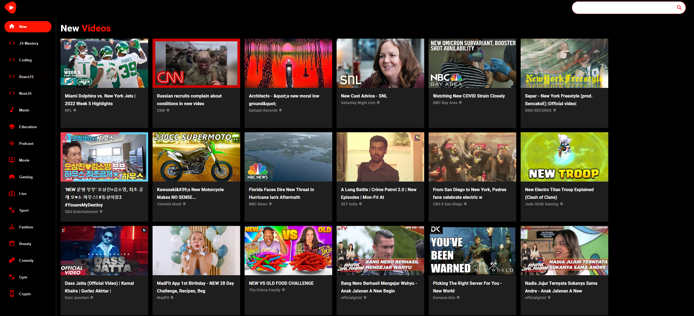
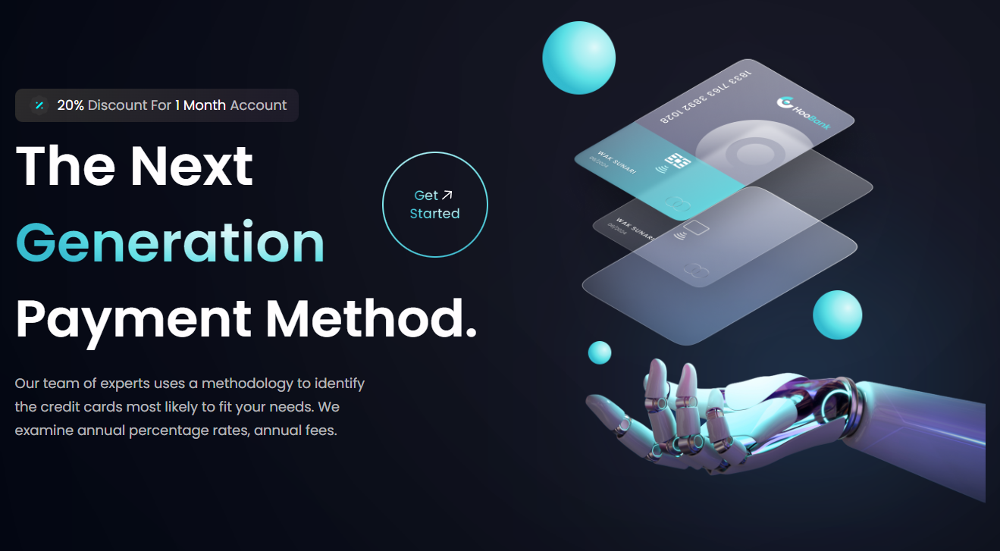
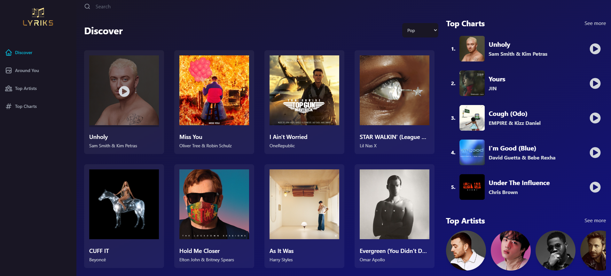
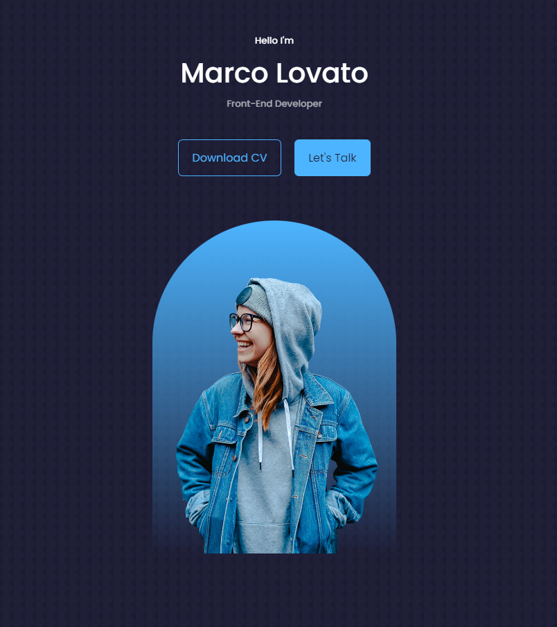

# Youtube pages

List of projects I made following youtube videos

## Projects :

- <a href="#deved">Dev Ed</a>

  - <a href="#deved-meditation">Meditation</a>
  - <a href="#deved-recipe">Recipe</a>

- <a href="#jsm">JSM</a>

  - <a href="#jsm-youtubeClone">Youtube Clone</a>
  - <a href="#jsm-landingPage">Landing Page</a>
  - <a href="#jsm-lyriks">Lyriks</a>

- <a href="#ninja">The Net Ninja</a>

  - <a href="#ninja-dojo">Ninja Dojo</a>
  - <a href="#ninja-router">React Router in Depth</a>

- <a href="#egator">Egator</a>

  - <a href="#egator-portfolio">Portfolio</a>

---

## 
Dev ed

### 
 Meditation 

---

### 
 Recipe

---

## 
JSM

### 
 Youtube Clone 

---

### 
 Landing Page 

---

### 
 Lyriks 

---

## 
The Net Ninja

### 
 Ninja Dojo 

### 
 React Router in Depth 

### 
 React Budgeting project 

---

## 
EGATOR

### 
 Portfolio 

---
